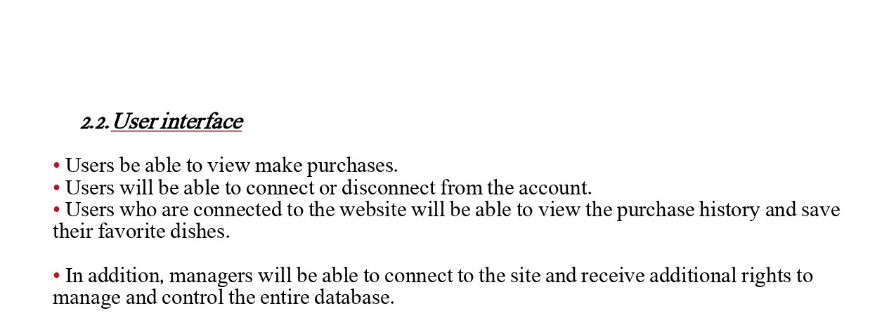
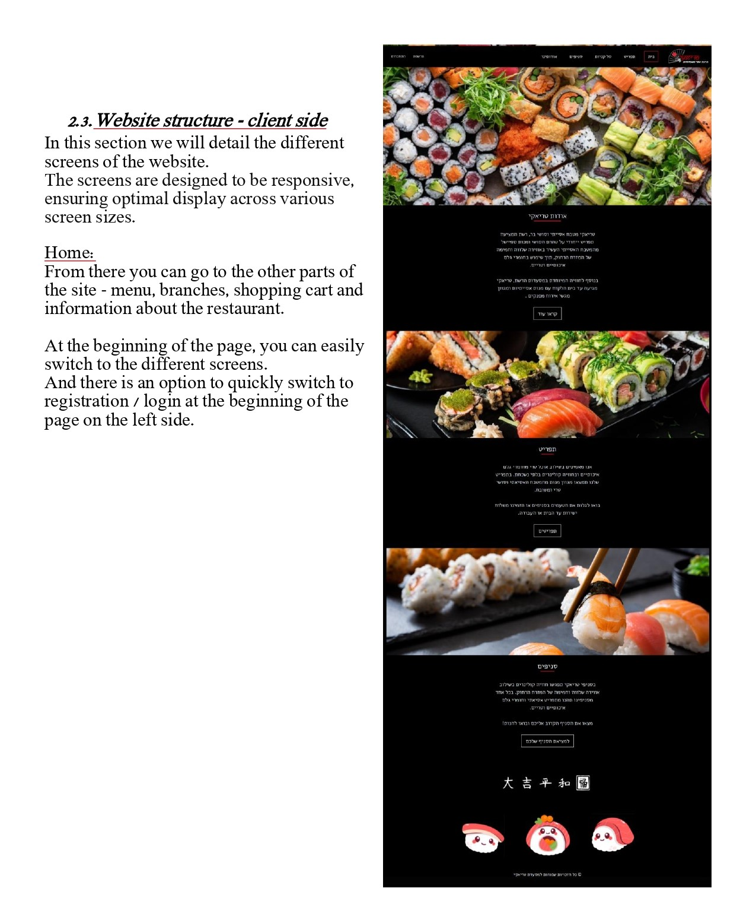
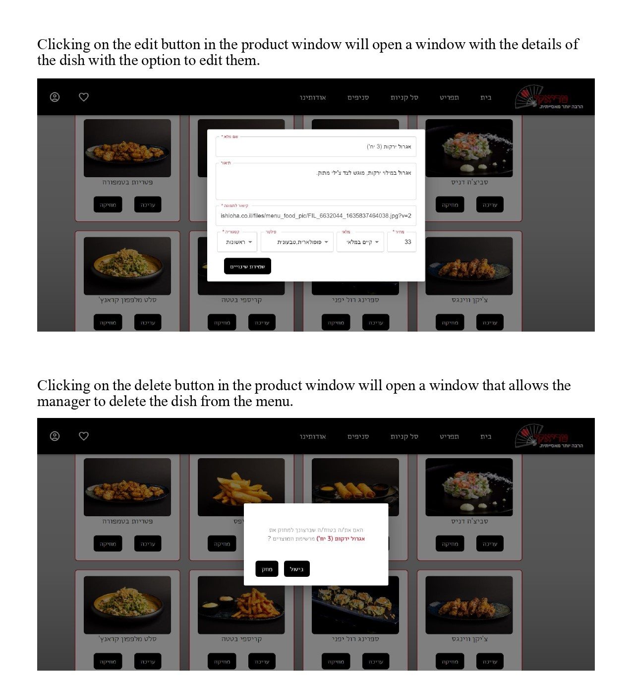
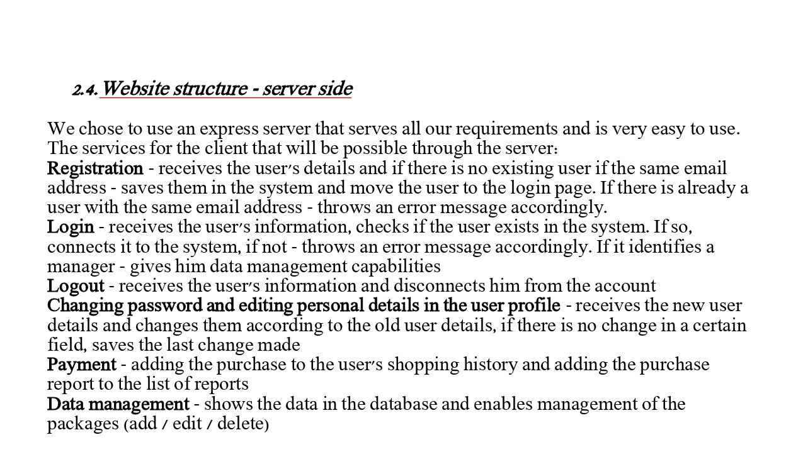

# Restaurant Website

# Table of Contents

1. [Overview](#overview)
2. [Directory Structure](#directory-structure)
3. [Tools and Libraries](#tools-and-libraries)
4. [Getting Started](#getting-started)

## Overview

## Directory Structure

**`Back/`** directory:
- **`model/`**: Contains the MongoDB schemas.
- **`routes/`**: Contains the routes definitions for processing incoming requests, interacting with the models, and sending responses back to the client.
- **`db.js`**: Handles the connection to the MongoDB database.
- **`index.js`**: The main entry point that sets up the Express server, calls `db.js` to connect to the database, and defines various routes for the application.

**`Front/src/`** directory:
- **`components/`**: Contains React components used throughout the application.
- **`pages/`**: Contains the pages of the website.
- **`redux/`**: Contains the Redux setup for state management.
- **`App.js`**: The main application component that sets up routing and renders the necessary components.

## Libraries and Tools

- **Node.js**: JavaScript runtime built on Chrome's V8 JavaScript engine.
- **Express**: A web application framework for Node.js, designed for building APIs.
- **JavaScript**: The programming language used for building the application.
- **React**: A JavaScript library for building user interfaces.
- **CSS**: For styling the website.
- **MUI**: A popular React UI framework for faster and easier web development.
- **Axios**: A promise-based HTTP client for making requests to APIs.
- **MongoDB**: A NoSQL database for storing data.

## Getting Started

To get started with the project, follow these steps:

1. Clone the repository to your local machine.
2. Navigate into the project directory.
3. Navigate to the `Back` directory.
4. Run `npm install` to install the necessary packages for the backend.
5. Execute `npm start` to start the backend server.
6. Navigate to the `Front` directory.
7. Run `npm install` to install the necessary packages for the frontend.
8. Execute `npm start` to start the frontend application.